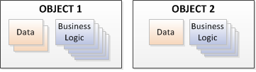
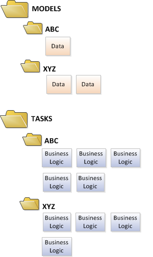

# Simpler

[](https://travis-ci.org/gregoryjscott/Simpler)

At its core, Simpler is a philosophy on or a pattern for C# class design. Simpler can help developers—especially teams of developers—build complex projects using consistent, readable classes that easily integrate with each other.

## Key Benefits of Simpler

- Eliminates the need to discuss and decide on class design
- Makes the code more understandable, consistent, and readable
- Simplifies [writing tests](#writing-tests)
- Provides a cleaner method of [addressing cross-cutting concerns](#eventsattribute)
- Simplifies maintenance by making it easier to find business logic

## The Simpler Philosophy

In the traditional Object-oriented Programming (OOP) approach, classes define objects (named with nouns) and include data and business logic (methods named with verbs).



But when an application needs to interact with several classes, it isn’t always clear where that business logic should be stored. So “manager” or “service” classes are often created for all of the business logic affecting multiple object classes.

With OOP, developers must constantly make decisions about where to place new business logic, a problem which is exacerbated by complex projects or when working with a team. Even with careful class design, it’s not always obvious where to find particular business logic, especially when maintaining code.

However, with Simpler, data and business logic are divided into small, discrete “building blocks.” Although you’ll have a lot of small classes—instead of a few, very large classes—these classes can easily integrate with each other without “manager” or “service” classes.

Simpler also separates data from business logic, with data defined in Model classes and business logic in Task classes.

To make finding the Tasks and Models easy, you can organize them within directories.



Model classes are typically just plain old CLR objects (POCOs) and only contain properties. But a Task *does things*; each Task class is the equivalent of a discrete action. Simpler provides functionality for Tasks.

## Installing Simpler

Use [Nuget](http://www.nuget.org/packages/simpler/).

## Using Simpler

Using Simpler is, well, *simple*.

1. [Create a Task class](#creating_tasks).
2. [Instantiate the Task](#instantiating_tasks) using the Task.New() method.
3. Execute the task.

Simpler also provides some additional functionality:

- From within a Task, [execute other Tasks (sub-tasks)](#injecting-sub-tasks)
- [Perform actions before or after execute](#eventsattribute), which is especially useful for addressing cross-cutting concerns such as logging
- Use [`Stats`](#stats) for profiling or for testing scenarios based on a Task executing or executing within a duration
- Use [`Name`](#name) for getting the name of the Task class, which is often useful for logging Task information
- When testing a Task with sub-tasks, isolate the Task logic by [mocking the sub-tasks](#mocking)

### <a name="creating_tasks"></a>Creating Tasks

You should create a new Task when you will be writing enough business logic to warrant tests. For example, if logic can be done in one line or using LINQ, there’s no reason to create a Task just for that.

If an existing Task grows in size over time and becomes hard to test, consider refactoring it into multiple Tasks. As a general rule, try to keep Tasks under 100 lines of code.

When you create a Task, you should name it so that everyone can easily identify what the Task does. Follow these naming rules:
 
- Begin each Task name with a verb (because the Task is action, it’s doing something)
- Clearly state the Task’s purpose in the name

>**Example:** A Task that parses an JSON file containing teams might be called *ParseTeamsJson*. But it shouldn’t be called *JsonTeamsParser* or *JsonTeams*.

Simpler provides 3 base classes for defining Tasks:

- [`InTask`](#intask) (applies business logic to an input but doesn’t produce any output)
- [`OutTask`](#outtask) (produces output using business logic but does not accept any input)
- [`InOutTask`](#inouttask) (applies business logic to an input and produces an output)

Simpler also includes a `Task` base class. This `Task` base class

- Includes the static `Task.New<TTask>()` method, which is a factory method for [instantiating tasks](#instantiating_tasks)
- Enables you to create a Task that has no inputs or outputs

In addition, all Tasks inherit the [`Name`](#name) property and the [`Stats`](#stats) property from this base class.

#### <a name="intask"></a>InTask

An `InTask` applies business logic to an input but doesn’t produce an output. For example, an `InTask` might receive an input of  information and write it to the console.

For an `InTask`, you must enter a generic parameter type that defines the type of input. This input is exposed to the `Execute()` method through the `In` property.

To make the `In` property a container for all input, you can define an `Input` class inside the `InTask`. This `Input` class contains the input as properties and is passed to the `InTask` as the generic parameter type.

```c#
public class OutputStat: InTask<OutputStat.Input>
{
    public class Input
    {
        public Stat Stat { get; set; }
    }

    public override void Execute()
    {
        var builder = new StringBuilder();
        builder.Append(String.Format("Question: {0}", In.Stat.Question));
        builder.Append(Environment.NewLine);
        builder.Append(String.Format("  Answer: {0}", In.Stat.Answer));
        builder.Append(Environment.NewLine);
        builder.Append(String.Format("  Reason: {0}", In.Stat.Details));
        Console.WriteLine(builder);
    }
}
```

#### <a name="outtask"></a>OutTask

An `OutTask` has no input, but it uses business logic to produce an output. For example, an `OutTask` might load a set of data and make the results available.

For an `OutTask`, you must enter a generic parameter type that defines the type of output. This output is exposed in the `Execute()` method through the `Out` property.

To make the `Out` property a container for all output, you can define an `Output` class inside the `OutTask`. This `Output` class contains the output as properties and is passed to the `OutTask` as the generic parameter type.

```c#
public class FetchTeams: OutTask<FetchTeams.Output>
{
    public class Output
    {
        public Team[] Teams { get; set; }
    }

    public override void Execute()
    {
        var teams = new List<Team>();

        dynamic baseball = Config.FromFile("baseball.json");
        foreach (dynamic team in baseball.Teams)
        {
            teams.Add(new Team {
                League = team.league,
                Division = team.division,
                Name = team.name,
                FirstSeason = team.since,
                G = Int64.Parse((string)team.g, NumberStyles.AllowThousands),
                W = Int64.Parse((string)team.w, NumberStyles.AllowThousands),
                Pennants = team.pennants,
                WorldSeries = team.worldSeries,
                Playoffs = team.playoffs,
                R = Int64.Parse((string)team.r, NumberStyles.AllowThousands),
                AB = Int64.Parse((string)team.ab, NumberStyles.AllowThousands),
                H = Int64.Parse((string)team.h, NumberStyles.AllowThousands),
                HR = Int64.Parse((string)team.hr, NumberStyles.AllowThousands),
                BA = team.ba,
                RA = Int64.Parse((string)team.ra, NumberStyles.AllowThousands),
                Era = team.era
            });
        }

        Out.Teams = teams.ToArray();
    }
}
```

#### InOutTask

An `InOutTask` is a combination of an [`InTask`](#intask) and an [`OutTask`](#outtask). An `InOutTask` applies business logic to an input and produces an output. For example, an `InOutTask` might answer a question by taking some information and using it to produce an answer.
 
For an `InOutTask`, you must enter 2 generic parameter types: one for the type of input and one for the type of output. As with an `InTask` and an `OutTask`, these parameters are exposed in the `Execute()` method through the `In` and `Out` properties respectively. You can also define `Input` and `Output` classes inside the `InOutTask`. Refer to [InTask](#intask) and [OutTask](#outtask) for additional information.

```c#
public class FindBestTeam: InOutTask<FindBestTeam.Input, FindBestTeam.Output>
{
    public class Input
    {
        public Team[] Teams { get; set; }
    }

    public class Output
    {
        public Team BestTeam { get; set; }
        public double WorldSeriesPercent { get; set; }
    }

    public override void Execute()
    {
        var wonWorldSeries = In.Teams.Select(t => new {
            Team = t,
            Percent = t.WorldSeries != 0
                ? Math.Round(t.WorldSeries / (double)(t.Age) * 100, 2)
                : 0
        });
        var best = wonWorldSeries.OrderByDescending(t => t.Percent).First();

        Out.BestTeam = best.Team;
        Out.WorldSeriesPercent = best.Percent;
    }
}
```

### <a name="instantiating_tasks"></a>Instantiating Tasks

When you have [created a Task](#creating_tasks), you can instantiate it using the `Task.New()` method.

>**Note:** Task.New() appears to return an instance of the Task. However, it actually returns a proxy of the Task. This proxy allows Simpler to intercept Task Execute() calls to perform actions before and/or after the Task executes using the **EventsAttribute**.

Do not use the `Task.New()` method to instantiate a Task from within another Task. Instead, use [sub-task injection](#injecting-sub-tasks).

```c#
public class Program
{
    static int Main(string[] args)
    {
        var outputBestTeams = Task.New<OutputBestTeams>();
        outputBestTeams.Execute();
        return 0;
    }
}
```

## Additional Simpler Functionality

### <a name="injecting-sub-tasks"></a>Injecting Sub-tasks

With Simpler, a Task contains the smallest piece of useable functionality. Therefore, you’ll often need a Task to execute other Tasks, referenced as sub-tasks, which creates a dependency between the Tasks. To prevent tight coupling between the dependencies, Simpler provides automatic sub-task injection.

>**Note:** Sub-task injection supports injecting dependencies at runtime. This type of injection is typically used for [testing purposes](#mocking).

To inject sub-tasks within a Task class, simply define the sub-tasks as properties. Any Task can be referenced as a sub-task. A sub-task is no different from a normal Task—it’s only called a sub-task when it’s defined as a property on another Task.

Before executing a Task, Simpler checks whether the Task has any sub-tasks. If so, Simpler automatically creates the sub-tasks and injects them into the Task properties.

```c#
[Log]
public class OutputBestTeams: Task
{
    public FetchTeams FetchTeams { get; set; }
    public FindBestTeam FindBestTeam { get; set; }
    public OutputStat OutputStat { get; set; }

    public override void Execute()
    {
        FetchTeams.Execute();
        var allTeams = FetchTeams.Out.Teams;

        var divisions = new[] {
            Filter(allTeams, "American", "East"),
            Filter(allTeams, "American", "Central"),
            Filter(allTeams, "American", "West"),
            Filter(allTeams, "National", "East"),
            Filter(allTeams, "National", "Central"),
            Filter(allTeams, "National", "West")
        };

        foreach (var division in divisions)
        {
            FindBestTeam.In.Teams = division.Teams;
            FindBestTeam.Execute();
            var team = FindBestTeam.Out.BestTeam;
            var percent = FindBestTeam.Out.WorldSeriesPercent;

            OutputStat.In.Stat = new Stat {
                Question = String.Format(Question, division.Name),
                Answer = team.Name,
                Details = String.Format(Details, team.WorldSeries, percent, team.Age),
            };
            OutputStat.Execute();
        }
    }

    const string Question = "Who is {0}'s best team?";
    const string Details = "They've won the World Series {0} times ({1}%) in their {2} years.";

    #region Helpers
    static dynamic Filter(IEnumerable<Team> allTeams, string league, string division)
    {
        return new {
            Name = String.Format("{0} League {1}", league, division),
            Teams = allTeams.Where(t => t.League == league && t.Division == division).ToArray()
        };
    }
    #endregion
}
```

### <a name="eventsattribute"></a>Performing Actions Before or After Execute

When you use the [`Task.New<TTask>()`](#instantiating_tasks) method, it returns a proxy to the Task, which enables Simpler to intercept Task `Execute()` calls using the `EventsAttribute`. When the `Execute()` call is intercepted, Simpler can perform actions before or after the Task executes or when the Task errors.

This intercepting is especially useful for addressing cross-cutting concerns, such as logging, as the `EventsAttribute` can be sub-classed and easily applied to Tasks.

The following example shows a custom `EventsAttribute` for logging Task activity.

```c#
public class LogAttribute : EventsAttribute
{
    public override void BeforeExecute(Task task)
    {
        if (Enabled) Console.WriteLine("{0} started.", task.Name);
    }

    public override void AfterExecute(Task task)
    {
        if (Enabled) Console.WriteLine("{0} finished.", task.Name);
    }

    public override void OnError(Task task, Exception exception)
    {
        if (Enabled) Console.WriteLine("{0} bombed! Details: {1}.", task.Name, exception);
    }

    public static bool Enabled = true;
}
```

This `LogAttribute` can be applied to any Task to add logging functionality. You might have noticed the `OutputBestTeams` Task in the [sub-task injection](#injecting-sub-tasks) example has the `Log` attribute. The `OutputBestTeams` output will be wrapped with "started" and "finished" log entries if `OutputBestTeams` is executed and `LogAttribute.Enabled  == true`.

```
Examples.Tasks.OutputBestTeams started.
Question: Who is American League East's best team?
  Answer: New York Yankees
  Reason: They've won the World Series 27 times (23.89%) in their 113 years.
Question: Who is American League Central's best team?
  Answer: Detroit Tigers
  Reason: They've won the World Series 4 times (3.54%) in their 113 years.
Question: Who is American League West's best team?
  Answer: Oakland Athletics
  Reason: They've won the World Series 9 times (7.96%) in their 113 years.
Question: Who is National League East's best team?
  Answer: Miami Marlins
  Reason: They've won the World Series 2 times (9.52%) in their 21 years.
Question: Who is National League Central's best team?
  Answer: St. Louis Cardinals
  Reason: They've won the World Series 11 times (8.33%) in their 132 years.
Question: Who is National League West's best team?
  Answer: Arizona Diamondbacks
  Reason: They've won the World Series 1 times (6.25%) in their 16 years.
Examples.Tasks.OutputBestTeams finished.
```

### Using Stats and Name Properties

The `Stats` and `Name` properties, which all Tasks inherit from the `Task` base class, are typically used in testing or logging.

#### <a name="stats"></a>Stats

A Task's `Stats` property tracks how many times the Task is executed and the execute durations. `Stats` are useful for profiling as well as for testing scenarios when you need to assert that a Task or sub-task has been executed as expected.

Refer to the [Mocking example](#mocking) to see the `Stats` property in use.

#### <a name="name"></a>Name

Because [`Task.New<TTask>()` returns a proxy](#instantiating_tasks) to the Task it's `GetType().Name` property will be the proxy class, which isn't useful. To get a read-only name based on the Task class itself, use the `Name` property.

Refer to the [`EventsAttribute` example](#eventsattribute) to see the `Name` property in use.

## <a name="writing-tests"></a>Writing Tests with Simpler

By design, Simpler forces you to create code that is easy to test. Each Task clearly defines its inputs, outputs, and the discrete code to test, so writing a test is typically straightforward.

Simpler also includes functionality to make writing tests easier:

- If your Task includes sub-tasks, isolate the logic of the Task being tested by [mocking the sub-task behavior](#mocking) using `Fake.Task<TTask>()`.
- Use the [`Stats`](#stats) property to test scenarios such as asserting that a Task has executed as expected or within a expected duration.
- Use the [`Name`](#name) property to get a read-only name of the Task class.

```c#
[TestFixture]
public class FindBestTeamTest
{
    [Test]
    public void picks_team_with_highest_World_Series_percentage()
    {
        var findBestTeam = Task.New<FindBestTeam>();
        findBestTeam.In.Teams = new[] {
            new Team {
                Name = "Good Team",
                FirstSeason = 2010,
                WorldSeries = 1
            },
            new Team {
                Name = "Better Team",
                FirstSeason = 2010,
                WorldSeries = 3
            }
        };
        findBestTeam.Execute();

        Assert.That(findBestTeam.Out.BestTeam.Name, Is.EqualTo("Better Team"));
        Assert.That(findBestTeam.Out.WorldSeriesPercent, Is.EqualTo(75));
    }
}
```

### <a name="mocking"></a>Mocking

When writing a test for a Task with an [injected sub-task](#injecting-sub-tasks), you may want to isolate the test to only the Task’s business logic. Using `Fake.Task<TTask>()`, you override the sub-task’s `Execute()` logic and replace it with any logic necessary to serve the need of the test. For example, you might choose to skip writing to disk in your test by faking the responsible sub-task.

If the Task has many sub-tasks, it’s easier to begin with a call to `Fake.SubTasks()` and then fake the individual tasks that are needed for the specific test scenario.

```c#
[TestFixture]
public class OutputBestTeamsTest
{
    [SetUp]
    public void DisableLogging() { LogAttribute.Enabled = false; }

    [Test]
    public void outputs_best_teams_in_each_division()
    {
        var stats = new List<Stat>();
        var storeStats = Fake.Task<OutputStat>(os => stats.Add(os.In.Stat));

        var outputsBestTeams = Task.New<OutputBestTeams>();
        outputsBestTeams.OutputStat = storeStats;
        outputsBestTeams.Execute();

        var questions = String.Join("|", stats.Select(s => s.Question));
        Assert.That(questions.Contains("American League East"));
        Assert.That(questions.Contains("American League Central"));
        Assert.That(questions.Contains("American League West"));
        Assert.That(questions.Contains("National League East"));
        Assert.That(questions.Contains("National League Central"));
        Assert.That(questions.Contains("National League West"));
    }

    [Test]
    public void runs_under_1_second()
    {
        var skipOutput = Fake.Task<OutputStat>();

        var outputsBestTeams = Task.New<OutputBestTeams>();
        outputsBestTeams.OutputStat = skipOutput;
        outputsBestTeams.Execute();

        var seconds = outputsBestTeams.Stats.ExecuteDurations.Max(ed => ed.TotalSeconds);
        Assert.That(seconds, Is.LessThan(1));
    }
}
```

## Contributing

See [Contributing](CONTRIBUTING.md).

## License

Simpler is licensed under the MIT License. See [License](LICENSE).

## Simpler HOF

The following individuals are in the Simpler Hall of Fame.

- [bobnigh](https://github.com/bobnigh) (pre, betas)
- [Clancey](https://github.com/Clancey) (contributor, betas)
- [corys](https://github.com/corys) (betas)
- [Crosis](https://github.com/Crosis) (betas)
- [danvanorden](https://github.com/danvanorden) (betas)
- [dchristine](https://github.com/dchristine) (betas)
- [jkettell](https://github.com/jkettell) (pre, betas)
- [JOrley](https://github.com/JOrley) (betas)
- [jshoemaker](https://github.com/jshoemaker) (pre)
- [kamillf](https://github.com/kamillf) (contributor)
- [Pete Rose](http://en.wikipedia.org/wiki/Pete_Rose) (4,256 hits)
- [ralreegorganon](https://github.com/ralreegorganon) (contributor)
- [rlgnak](https://github.com/rlgnak) (contributor, betas)
- [rodel-rdi](https://github.com/rodel-rdi) (betas)
- [sonhuilamson](https://github.com/sonhuilamson) (betas)
- [timrisi](https://github.com/timrisi) (betas)

### Legend

**pre** - Worked on a project that inspired Simpler, which included a Task class with sub-task injection. [bobnigh](https://github.com/bobnigh) was a co-author of the original Task class.

**betas** - Provided feedback on Simpler 1 or later beta versions of Simpler.

**contributor** - Has contributed to Simpler.
